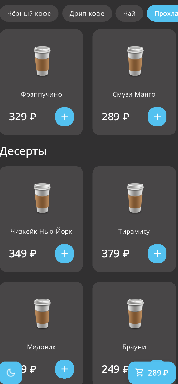
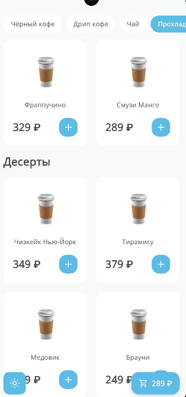
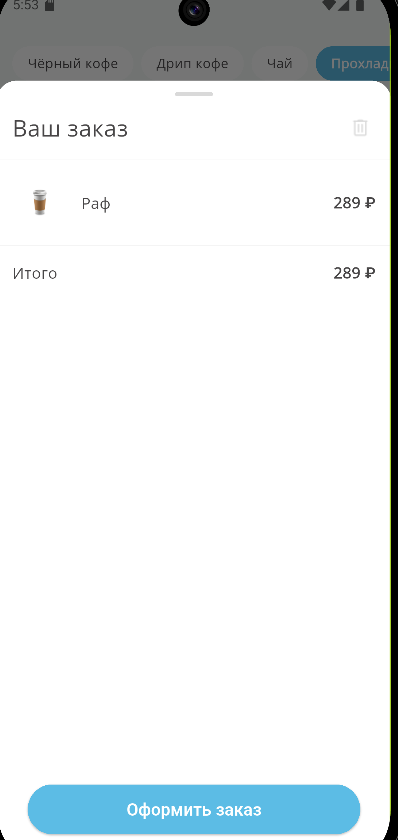

# RandomCoffee


Прототип мобильного приложения для заказа кофе из кофейни RandomCoffee, разработанный на Flutter в рамках тестового задания.

## Описания

Приложения позволяет:
- загружать категории и товары из сети;
- просматривать товары по категориям;
- открывать экран подробной информации о товаре;
- добавлять товары в корзину;
- изменять количество товаров в корзине;
- оформлять заказ;
- переключать светлую и тёмную темы.

Проект реализован с использованием Figma-макета и Swagger API, предоставленных в задании.

## Используемый стек

- Flutter
- Dart
- flutter_riverpod
- Dio
- CachedNetworkImage
- SharedPreferences
- Google Fonts

## Реализованный функционал

- Верстка экранов по макету Figma
- Загрузка товаров из сети
- Обработка ошибок при сетевых запросах
- Retry логика для HTTP-запросов
- Отображение товаров, сгруппированных по категориям
- Переход с карточки товара на экран деталей
- Добавление товаров в корзину
- Ограничение корзины не более 10 позиций суммарно
- Ограничение количества одного товара не более 10
- Оформление заказа через API
- Отображение SnackBar при успешном и неуспешном заказе
- Сохранение и восстановление состояния корзины

## Дополнительно

- Реализована светлая и тёмная тема
- Реализована прокрутка к выбранной категории по нажатию на category chip


## Архитектура

Проект организован по принципу feature-first.

### Структура проекта

````text
lib/
    core/
        constants/
        network/
        storage/
        theme/
    features/
        menu/
        cart/
        order/
        product_detail/
    app.dart
     main.dart
````

## Разделение по слоям

- core — общие зависимости, тема, константы, сеть, local storage;
- features/.../data — модели и репозитории;
- features/.../presentation — экраны, виджеты, providers.

## State management

Для управления состоянием используется Riverpod:

- AsyncNotifier — загрузка меню;
- Notifier — корзина и тема приложения.
## Работа с API
В приложении используются только необходимые методы из Swagger:

- GET /categories
- GET /products
- GET /products/{id}
- GET /cart
- POST /cart/items
- PUT /cart/items/{product_id}
- DELETE /cart/items/{product_id}
- DELETE /cart
- POST /orders

## Обработка ошибок
- Добавлена retry-логика для сетевых запросов
- Ошибки загрузки меню отображаются на экране
- Ошибки оформления заказа отображаются через SnackBar
- Обработаны nullable-поля в ответах API
- Обработаны случаи с количеством товаров, превышающим ограничения приложения

## Особенности реализации
- Используется Open Sans в соответствии с UI-kit
- Реализованы светлая и тёмная темы
- Цвета вынесены в AppColors
- Темы оформлены через AppTheme
- Для карточек товаров реализована адаптация под длинные названия
- В корзине каждая единица товара отображается отдельной строкой, если quantity > 1
## Ограничения и принятые решения
- Для работы с корзиной используется серверное состояние корзины
- Ограничение на добавление товаров применяется как по количеству одного товара, так и по суммарному числу товаров в корзине
- Некоторые визуальные расхождения с макетом незначительны и связаны с адаптацией под Flutter-реализацию

## Запуск проекта
Установить зависимости:

- flutter pub get

Запустить приложение:

- flutter run

## Скриншоты





## Git workflow
Разработка велась через ветку develop и отдельные feature-ветки.
Коммиты оформлялись по Conventional Commits.

Примеры:

- feat: implement menu screen with categories and cards
- feat: connect menu screen to API data with real categories and products
- fix: enforce total cart limit of 10 items across all products
- docs: add project readme

## Pull Request

Финальная версия приложения оформляется через Pull Request из develop в main.

